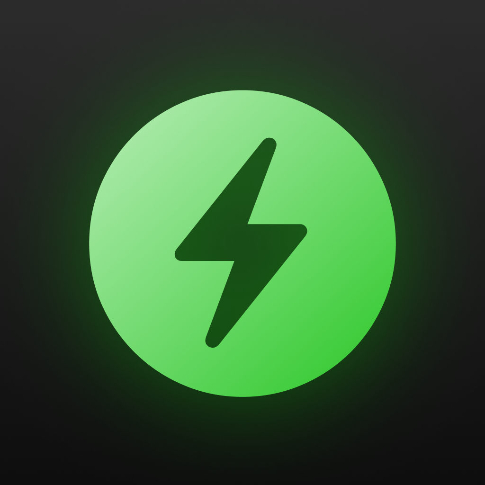

<div align="center">
  

  <h1>Coffein</h1>
  <p><strong>A native macOS utility to keep your Mac awake, with clean controls and a menu bar-first workflow.</strong></p>

  <p>
    
    
    
    
  </p>
</div>

---

## Why I built this

I made Coffein because I wanted a better everyday alternative to jumping into Terminal whenever I needed to prevent sleep.  
The goal was simple: keep it lightweight, native, and fast to use from the menu bar, while still giving enough control for real work sessions (renders, uploads, presentations, long coding runs).

---

## What it does

<table>
  <tr>
    <th align="left">⚡ Awake Control</th>
    <th align="left">⏱️ Timers</th>
  </tr>
  <tr>
    <td valign="top">
      <ul>
        <li>One-click awake/idle toggle</li>
        <li>Prevents sleep using native macOS power assertions</li>
        <li>Live menu bar status + tooltip updates</li>
      </ul>
    </td>
    <td valign="top">
      <ul>
        <li>Quick presets (30m, 1h, 2h, 3h)</li>
        <li>Custom hours/minutes timer</li>
        <li>Configurable timer end action (deactivate or sleep)</li>
      </ul>
    </td>
  </tr>
  <tr>
    <th align="left">🔋 Battery Safety</th>
    <th align="left">🧩 Native Integration</th>
  </tr>
  <tr>
    <td valign="top">
      <ul>
        <li>Battery threshold setting</li>
        <li>Can block activation when battery is too low</li>
        <li>Auto-deactivates if battery drops below threshold</li>
      </ul>
    </td>
    <td valign="top">
      <ul>
        <li>Launch at login support</li>
        <li>Custom AppKit app menu + status item flow</li>
        <li>SwiftUI UI with AppKit delegate bridge where needed</li>
      </ul>
    </td>
  </tr>
</table>

---

## Settings & architecture highlights

- **Sleep modes**
  - `System + Display`
  - `System only`
  - `Display only`
- **Settings surface**
  - Theme mode
  - Launch at login
  - Sleep mode behavior
  - Battery safety threshold
- **Core implementation**
  - `Coffein/Coffein/CoffeinManager.swift`: app state, timer lifecycle, battery gating, launch-at-login
  - `Coffein/CoffeinApp.swift`: app lifecycle, custom menu/status integration
  - `Coffein/ContentView.swift` + `Coffein/SettingsView.swift`: main UI and settings
  - `IOKit` assertions via `CoffeinSleepManager` for native sleep prevention

---

## Build & run

```bash
# 1) Open the project
open Coffein.xcodeproj
```

```bash
# 2) In Xcode:
# - Select scheme: Coffein
# - Build and run on macOS
```

If you prefer command-line listing/checks:

```bash
xcodebuild -list -project Coffein.xcodeproj
```

---

## Project structure

```text
Coffein/
├─ Coffein.xcodeproj/
├─ Coffein/
│  ├─ CoffeinApp.swift
│  ├─ ContentView.swift
│  ├─ SettingsView.swift
│  ├─ AboutView 2.swift
│  └─ Coffein/
│     └─ CoffeinManager.swift
└─ CoffeinHelper/
```

---

## License

MIT — see [LICENSE](LICENSE).
